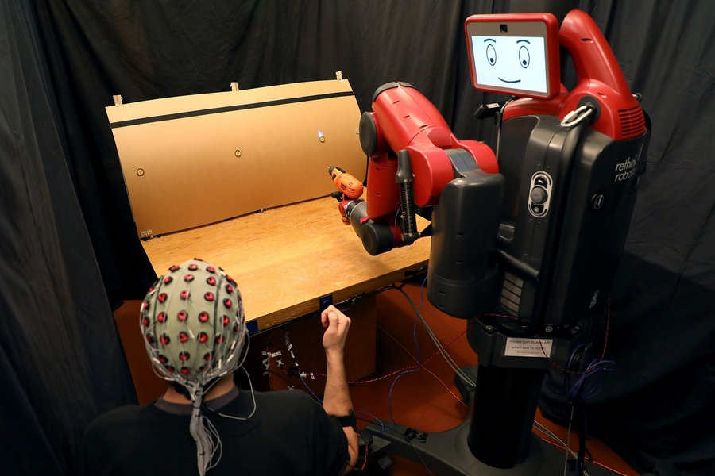
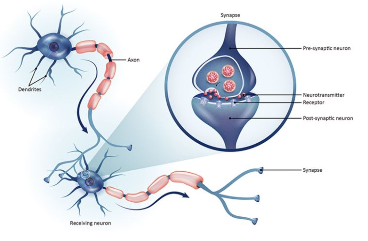

Artificial intelligence and neuroscience have a very close relationship. Knowledge from neuroscience can be utilized for improving AI and it is also true in reverse.

As we have known, the artificial neural network gets its idea from the way our brain works and so do many approaches. This makes sense because if we want to build a thing on the basis of another thing, why not conduct an investigation into the original one.

In opposite, AI can also support works related to neuroscience. For example, Chethan Pandarinath wants to identify the electrical pattern of neurons by using the artificial neural network to help paralyzed people move their hands and legs [1]. Besides the work of Pandarinath, more and more researches about brain-controlled robot have also been carried out. From the brain signal wave which is very complicated, ANN will learn specific patterns (also called underlying structures) and then decide what a man wants a robot to do.

    <em><b>Figure 1:</b> Brain-controlled robot of MIT CSAIL (Image from [3]).</em> This system uses machine learning to classify brain waves, which allows people to correct robot mistakes.

The ANN is constructed by layers of nodes which is similar to neurons, and the calculations of its parameters are made by using matrix operations. According to [1], each value in a matrix represents a synapse (which is “a structure that permits a neuron to pass an electrical or chemical signal to another neuron or to the target effector cell” [2]). You may wonder whether it is enough to represent a synapse by only a scalar value. David Sussillo, who is currently Adjunct Professor at Stanford, has given remarkable information about this “You couldn’t get further from the truth of what a synapse actually is than a single number in a matrix” [1].

    <em><b>Figure 2:</b> Neurites and Synapses (Image from [4]).</em>

Despite having had great achievements, neural networks currently still deal with some big questions [1]:

* One is about **how the brain learns**. It is said that human does not learn to recognize something with labels as supervised learning does. To discriminate between a cat and a dog, a human just needs to be taught the first time with several samples.
* Another is about **if some parts of the intelligence which have been available in the brain at the beginning of our life are a result of evolution**. This may raise some new research subjects in the AI community.
* **The morality of AI** is also concerned. No one likes the “evil machines”.

Now we know that AI originates from neuroscience and then can also be applied back to it. This circle will continue so both fields can incorporate good things from each other. To improve AI, it is not just a need but a requirement that we should have extensive references from the neuroscience field.

## References

[1] Neil Savage, [Marriage of mind and machine](https://braincouncil.be/en/burden-of-brain-diseases_evidence/the-brain/brain-s15-artificial-intelligence.pdf), Nature, 2019.

[2] [Synapse](https://en.wikipedia.org/wiki/Synapse), Wikipedia.

[3] Adam Conner-Simons, [How to control robots with brainwaves and hand gestures](https://news.mit.edu/2018/how-to-control-robots-with-brainwaves-hand-gestures-mit-csail-0620), MIT News, 2018.

[4] [Neurites & Synapses](https://www.genetex.com/Research/Overview/neuroscience/neurites_synapses), GeneTex.