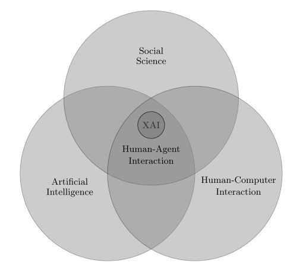

Many AI subfields will get considerable advantage from the ability of explanation, such as “justifying autonomous agent behavior, debugging machine learning models, explaining medical decision-making” \[1]. However, the author say that most of the recent research in XAI still depends a lot on the researchers’ intuitions to specify what is a good explanation. In the paper, the author defines the term “Explainable AI” as “an explanatory agent revealing underlying causes to its or another agent’s decision making” \[1].

Artificial intelligence (AI) should not be seen as a stand-alone field, it has strict constraints with social science since what we are trying to do is to simulate the human brain. Besides, human-computer Interaction is another aspect that is also worth considering along with AI. Explainable AI cannot be achieved by only improving AI, but it is also related to social science and human-computer interaction. Notably, we have even more problems when talking about Human-Agent Interaction, the XAI is just one of them.

In the paper, he confine his attention to the top circle of social science and its relation to the other two circles.

    <em><b>Figure 1:</b> Scope of Explainable Artificial Intelligence (Image from \[1]).</em>

The content of the paper includes three main factors and two subordinate factors (the last two bullet points):

* Survey of relevant articles on the philosophical, cognitive and social bases of explanation.
* Explanation of why particular facts (events, properties, decisions, etc.) happened, those that are not generalised theories in science.
* Important points which show the relationship between relevant articles and different subfields of XAI.
* Causality.
* Approaches to XAI that are constructed on the basis of social science.

Four crucial findings that may leverage XAI:

* “Explanations are contrastive”: they are formed with regards to particular counterfactual cases. An idea/event for explanation is not automatically established from elsewhere, but rather from a contrastive process among different ideas/events.
* “Explanations are selected”: people usually find causes/explanations in a biased way.
* “Probabilities probably don’t matter”: causes have more profound effects than probabilities and statistics in explanation. The most probable explanation is not the best one for a person all the time, but we should consider the causal factors which are possibly from the context that the person is currently in. 
* “Explanations are social”: they are a knowledge transfer, which significantly depends on the human’s beliefs.

Usually, while an event can be from many causes, the explainer just has interests in some elements relevant to the context.

Having AI models from which we can demand explanation is a very challenging task. As approaching the problem by only computational approaches is seen as insufficient, there should be a combination with knowledge from other fields, such as philosophy, psychology and cognitive science, neuroscience.

## References

\[1] Tim Miller, [Explanation in Artificial Intelligence: Insights from the Social Sciences](https://arxiv.org/pdf/1706.07269.pdf), Artificial intelligence 267, 2019.