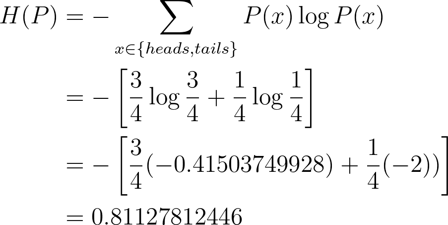
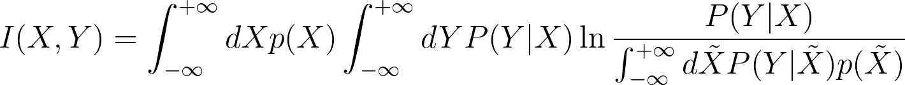

## Entropy \[1, 2]

The knowledge of entropy is required to understand mutual information.

The entropy calculates the “unpredictability” of a random variable, which means that it will return high value for a random variable with high level of unpredictability and low value for the one that is more easily predictable.

The entropy equation:

Two examples to show when entropy is low and when it is high. 

**Example 1** Compute the entropy of a fair coin (from \[1])

Given that:

Using entropy equation, we have:

**Example 2** Compute the entropy of an unfair coin

Given that:

Using entropy equation, we have:

\=> The entropy value is less than that in example 1. Because the coin will appear heads most of the time, which means it is more predictable (less unpredictable). Thus, the entropy is low.

**Example 3** Compute the entropy of an unfair 6-sided dice (from \[1])

Given that:

Using entropy equation, we have:

\=> The more values a random variable can take, the more unpredictable it becomes.

## Mutual information \[1, 2, 3, 4, 5, 6]

Mutual information measures a relationship between two random variables which are sampled concurrently. In other words, mutual information is an estimation of the amount of information in one variable which uncovers another variable. It tells how much information on one variable can averagely convey about the other. The value of mutual information is 0 if the two random variables are statistically independent.

Mutual information can also be defined as “the reduction in uncertainty about a random variable given knowledge of another” \[3]. Mutual information with a high value corresponds to a great reduction in uncertainty \[3].

The equation for mutual information of two random variables X and Y where joint distribution is represented as PXY(x,y):

where PX(x) and PY(y) are the marginals.

### Another way to think about the mutual information

Suppose we have an information system that can be split into 3 components: sender, channel, and receiver (or in particular input image, neural network, and output representation). The channel can be represented by a transition probability matrix.

    <em><b>Figure 1:</b> The formal decomposition Sender-Channel-Receiver (Image from \\\\\\[2]).</em>

Considering that the sender is represented by a pattern set X including xis and the corresponding probability density function p(xi), the receiver is represented by a pattern set Y including yis and the corresponding probability density function p(yi). The channel is characterized by the conditional probability matrix P(yj | xi) in which each element is the conditional probability density function pairwise calculated between elements in X and Y.

The Shannon entropy equation on X and on Y:

The formula of conditional entropy, it measures the uncertainty of X given Y:

The formula of joint entropy (the entropy of a joint probability distribution) on X and Y:

Then, the equation mutual information will be:

Let's verify if it is equal to the above equation for mutual information of two random variables X and Y:

So yes, they are equal except for the difference in the base of the log. For your information, the log base can be 2, 10, or e, which depends on what information units an information system needs.

And with a theorem H(X|Y) = H(X, Y) - H(Y) of conditional entropy (if X and Y are discrete random variables), the mutual information formula can also be written as:

To be more clearly about the above formula, let’s consider 2 cases:

* **Ideal channel:** for any given i, x_i = y_i. All the things sent by the sender are received by the receiver. And we can prove that (more details in \[2]):

* **Fully disturbed channel:** the output is totally not affected by the input, which means p(y_j | x_i) = p(y_j) => p(x_i, y_j) = p(x_i).p(y_j). We can prove that (more details in \[2]):

Finally, the mutual information can be defined as a measurement which quantifies the transmitted information in the channel.

From the two cases, we can infer that in the AMDIM model, the network tries to keep the two samples of the same class (despite being from different viewpoints) as close as possible. From a different view, ‘close’ here means there is an “invisible” channel from one sample to another sample and this channel is ideal so that the mutual information of two samples are maximized. Then meaningful features/representations can be learned, especially those that can deal with the challenge of varying viewpoints (location, color, light, scale variation due to augmentation).

### Maximization of mutual information

In \[2], the problem is formulated as follows: 
“the central principle for an information-theoretical optimization in feedforward structure says: for a given xi, yj and a given input distribution p(xi), determine the matrix P(yj | xi) in such a way that the mutual information becomes maximized”

\=> Therefore, in the case of DeepInfoMax, P(yj | xi) represents the parameters/weights of a neural network.
Reformulation of the expression for the mutual information \[2]:

For discrete variables:

For continuous variables:

### Properties

Mutual information is closely related to the Kullback-Leibler divergence - a measure of how different one distribution is from another distribution (“distance” between two distributions).

The equation of Kullback-Leibler divergence of two distributions P(z) and Q(z):

The mutual information is actually the Kullback-Leibler distance between the joint distribution of X and Y, and the product of the marginal probabilities:

The symmetric property in mutual information:

The additive property for independent variables in mutual information. If

then:

## The InfoMax principle \[7, 8]

This principle is for optimization in information processing systems and also artificial neural networks. Its main point can be described by this sentence: a function that receives a collection of inputs I to produce a collection of outputs O needs to be chosen so that the mutual information between I and O is maximized \[7].

In terms of a perceptual network with local feedforward connections \[7] (see Figure 2, which is very similar to the neural network nowadays), we can point out some knowledge to understand more clearly about the Infomax principle. This paper of Linsker is actually the research work from which the InfoMax principle derives.

    <em><b>Figure 2:</b> A layered self-adaptive network with local feedforward connections (Image from \\\\\\[7]).</em>

 In particular, there are some things that the InfoMax principle quantitatively implies about this perceptual network. Below is a table in which the first column holds some pieces of information about the InfoMax principle we notice in the paper \[7] and the second column is our comment:

<table id="tabletype1">
<tr>
    <th id="colTitle1" width="50%">From the paper \\\\\\\[7]</th>
    <th id="colTitle2" width="50%">Our comment (if have)</th>
</tr>
<tr>
    <td>“Maximize the amount of information preserved from one layer to the next.”</td>
    <td>None</td>
</tr>
<tr>
    <td>“attempt to (1) maximize the total information conveyed by the output message M, and (2) minimize the information that M conveys to one who already knows the input message L.”</td>
    <td>It is possible that the output message should contain as much information as possible (1) along with the condition that this output also does not share too much human information in accordance with the input (2).

\=> to extract the most essential (and also relevant) part of the information for the balance of compactness and quality.

</td>
</tr>
<tr>
    <td>“These criteria are related, but not equivalent, to the property of encoding signals so as to reduce redundancies present among the inputs to the perceptual system.”</td>
    <td>The two criteria above do not only serve for solving the problem of reducing redundancies in the input.</td>
</tr>
<tr>
    <td>“A high noise level favors redundancy.”</td>
    <td>Redundancy means there is a high noise level.</td>
</tr>
<tr>
    <td>“Much of this work has focused on the role of redundancy reduction. This property is one, but only one, aspect of the infomax principle. For example, we have seen that infomax also leads to the introduction of redundancy when this is useful in countering the effects of noise.”</td>
    <td>In addition to redundancy reduction, the InfoMax principle also leads to other properties. They are listed below this table.</td>
</tr>
</table>

**Some properties** of the InfoMax principle in L-to-M (input-to-output) transformations (from \[7]):

* “**near-neighbors** in L tend to map to **near-neighbors** in M.”
* “a greater number of M cells tend to represent the types of layer-L excitation **patterns that occur more often**.”
* “The infomax principle selects which features of the input signals are represented in layer M. **Features having relatively high signal-to-noise ratios** are favored.”
* “When time-delayed information is made available to the layer, the infomax principle can cause M cells to **extract and encode temporal correlations**, in a manner similar to the extraction of spatial correlations.”

## DeepInfoMax \[9, 10]

### The main idea

DeepInfoMax is a self-supervised learning method with the aim of learning from unlabeled data and being more independent with manually annotated data.

Its process operates in a similar vein with the InfoMax principle: it learns to create good high-level representations by trying to maximize the mutual information between the input and output of an encoding architecture, while the InfoMax principle for the self-adaptive perceptual network above maximizes the mutual information between outputs of different layers of neural architecture.

By doing this, it hopes the model can learn the way of how to extract representations that still keep the most relevant and important cues from the original input.

We can also see this objective of maximizing mutual information as a pretext task in self-supervised learning. Through this pretext task, the authors hope the neural architecture can extract features/representations of good quality.

## Augmented Multiscale DeepInfoMax \[11]

The last one - Amdim is developed based on the DeepInfoMax with some modifications and improvements.

### Inheritance from DeepInfoMax

Amdim is a self-supervised learning model based on local Deep InfoMax (DIM). “Local DIM maximizes mutual information between a global summary feature vector, which depends on the full input, and a collection of local feature vectors pulled from an intermediate layer (or from different patches of the input image?) in the encoder.” 

### What are its differences with DeepInfoMax

It carries out the mutual information maximization between features from multiple views of a context object, not between the input and output of an encoding architecture.
Multiple views of a local spatial-temporal context can be obtained by looking from different locations (putting cameras at different positions) and gathering information from different modalities. Data-augmented versions of an image can also be seen as multiple views of an image.
To maximize this type of mutual information, it is required that a model has the ability to acquire information of high-level factors that coexist in every single view of a specified context (for example: “presence of certain objects or occurrence of certain events”). 

### The improvements

The Amdim model produces 3 improvements to local DIM:

* Features are predicted over independently augmented versions of each input.
* Simultaneously, features are also predicted over multiple scales of each input.
* It uses a more powerful encoder.

## Conclusion

Here we have shown some knowledge of entropy, mutual information, InfoMax principle, DeepInfoMax, Amdim and try to connect pieces of information so that you can acquire their relations in the most simple way we can. About DeepInfoMax and Amdim, we just provide the ideas. The details of them may be exposed in our next posts.

## References

\[1] Erik G. Learned-Miller, [Entropy and Mutual information](https://people.cs.umass.edu/~elm/Teaching/Docs/mutInf.pdf), University of Massachusetts, Amherst - Department of Computer Science, 2013

\[2] Jens Christian Claussen, [The Infomax principle: Maximization of Mutual Information](http://webmail.inb.uni-luebeck.de/~claussen/sysbio2012/infotheo.pdf), University of Lübeck, 2012

\[3] Peter E. Latham and Yasser Roudi, [Mutual information](http://www.scholarpedia.org/article/Mutual_information), Scholarpedia, 2009

\[4] Frank Keller, [Formal Modeling in Cognitive Science](http://www.inf.ed.ac.uk/teaching/courses/fmcs1/slides/lecture25.pdf), University of Edinburgh - School of Informatics, 2006

\[5] Iftach Haitner, [Joint & Conditional Entropy, Mutual Information](http://www.cs.tau.ac.il/~iftachh/Courses/Info/Fall14/Printouts/Lesson2_h.pdf), Tel Aviv University, 2014

\[6] [What does maximizing mutual information do?](https://stats.stackexchange.com/questions/480918/what-does-maximizing-mutual-information-do), StackExchange

\[7] Ralph Linsker, Self-Organization in a Perceptual Network, IBM Research, 1988

\[8] [InfoMax](https://en.wikipedia.org/wiki/Infomax), Wikipedia

\[9] Devon Hjelm, Philip Bachman, Adam Trischler, [Deep InfoMax: Learning good representations through mutual information maximization](https://www.microsoft.com/en-us/research/blog/deep-infomax-learning-good-representations-through-mutual-information-maximization/), Microsoft Research Blog, 2019

\[10] R Devon Hjelm et al., [Learning deep representations by mutual information estimation and maximization](https://arxiv.org/pdf/1808.06670.pdf?source=post_page---------------------------), ICLR, 2019

\[11] Philip Bachman et al., [Learning Representations by Maximizing Mutual Information Across Views](https://arxiv.org/pdf/1906.00910.pdf), arXiv, 2019