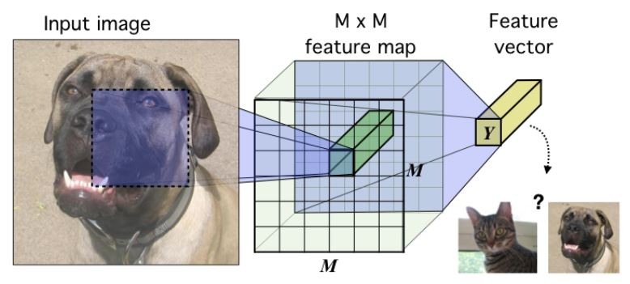
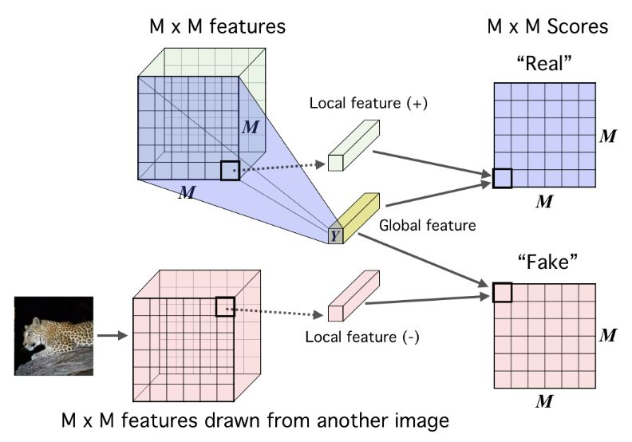

## Contrastive learning \[6] and Noise contrastive estimation \[7]

Let's first briefly talk about the ideas of Contrastive Learning, Noise Contrastive Estimation, and why they are used. 

In the pre-training stage of Self-supervised learning (the stage that a model solves pretext tasks), this process is carried out with the hope that the current model would learn meaningful representations from unlabeled data. Especially in the case of the contrastive approach, researchers try to contrast one positive sample with a set of negative samples to learn useful representations (See Figure 1 below). Notice that all the mentioned samples are unlabeled.

    <em><b>Figure 1:</b> Self Supervised Contrastive (Image from \\\\[6]).</em>
    A single positive sample which is produced from the anchor (original image) is used to contrast with a set of negative samples to learn meaningful representations. The big gray circle in the center is the embedding space. Samples of the same class should be mapped to locations close to each other while those that are of different classes should be pushed apart. Due to the unlabeled data, there will be cases a positive sample is falsely seen as a negative sample (as the white and black puppy here).

As we have known, a classification neural network is actually a multi-class classifier. When there are many classes in a dataset, the network is also required to have as many output neurons. Usually, many networks use the cross-entropy loss function, which needs output neurons to represent probabilities. And these probabilities are obtained by the softmax function of which the computation is not efficient enough in the case of a huge output layer. 

To overcome this, Noise Contrastive Estimation (NCE) is used. The idea/purpose of NCE is to transform a multi-class classification problem into a binary classification problem. The softmax to estimate the true distribution of a dataset is no longer used. Now, each training sample fed to the network includes a positive pair and a number of negative pairs. Usually, a positive pair consists of different augmented versions of the anchor sample and a negative pair is constructed by the anchor with a sample randomly picked from the other classes. This pretext task of discriminating positive pairs and negative pairs will help the network learn to produce representations having great meaning. So, that is why it is called binary classification (as we have seen in the figure above).

Several things also worth noting here are the cross-entropy is not robust enough to noisy labels \[8, 9] and it possibly produces poor margins \[10, 11]. These factors can badly affect the generalization performance.

In the next sections, before coming to Amdim, it is necessary to first introduce two contrastive learning methods that were published earlier: Contrastive Predictive Coding (CPC) \[1] and Deep InfoMax (DIM) \[2].

## Contrastive predictive coding \[1]

The amount of information in high-dimensional data can be very huge, so it is a very difficult task for the model to extract effective representations. CPC tries to deal with this problem by using autoregressive models. In particular, it uses these types of models to predict future representations in latent space (with the hypothesis that latent representation will be more compact than the input and directly predicting future representations from the previous ones also help to reduce the time execution). They also use a contrastive loss which makes maximally useful information can be captured by the latent space. With the contrastive loss, the model also becomes tractable by using negative sampling.

    <em><b>Figure 1:</b> Overview of Contrastive Predictive Coding (Image from \\\\[1]).</em>
    Here, audio input is used as an example but it can be replaced with another type of input such as an image.

Let’s describe the picture above. From bottom to top, the first thing is the audio input of which its vectors are represented as *x*. *genc* is a non-linear encoder that receives the sequence of observations *xt* as input and produces a sequence of representation *zt* , possibly with a smaller temporal size. Next, *gar*, which is an autoregressive model, summarizes all *z(&lt;=t)*  in the latent space and produces a context latent representation *ct*.

Some of the things proposed in this paper include: First, the embedding vectors are extracted from the high-dimensional input by a non-linear encoder. Those latent vectors should be more compact than the original ones, which gives a better opportunity to model conditional predictions. Additionally, powerful autoregressive models are used to accumulate the information (context latent representation) from the latent vectors through time. And these summary features are then used to (directly) predict the future latent vectors with the purpose of reduction in processing time. They build loss function on the Noise-Contrastive Estimation, which allows us to train the model end-to-end.

## Deep infomax \[2]

The representations are learned through the task of mutual information maximization between the input (global information) and output (local information) of a network encoder. Mutual information which is manually calculated by the equation in the previous post is infamous for its difficulty in computation, especially when data is continuous and high-dimensional. Due to this problem, recent advances have leveraged deep neural networks to compute mutual information more effectively. This paper emphasizes the importance of local information in the input instead of considering only the global information. Putting locality into the objective is supposed as a way to make a representation more high-grade and more appropriate to downstream tasks. Besides, the representations are also controlled in accordance with desired statistical properties by matching to a prior distribution adversarially?

Their main contributions include: They formalize Deep InfoMax (DIM) model. DIM does both tasks of estimating and maximizing the mutual information between input data and high-level representations in a concurrent way. Notably, DIM can choose whether local or global information is prioritized to adapt the learned representations for classification or reconstruction tasks. Adversarial learning is also used to keep the statistical characteristics of the representation the same as those of a specific prior.

DIM can work with various MI estimators.

    <em><b>Figure 2:</b> The base encoder model in the context of image data (Image from \\\\[2]).</em>

An MxM feature map is first got by feeding the input image through a convolutional network. Then, all vectors along the depth dimension of the MxM feature map are summarized into a single high-level features vector. Their goal is that the trained model can produce high-level feature vectors which still contain useful information from input.

<b>Training principle:</b> Find the set of parameters/weights so that I(X, E(X)) is maximized. The input X can be a complete image or just a local patch.

    <em><b>Figure 3:</b> Basic mutual information maximization framework: Deep InfoMax (DIM) with a global MI(X;Y) objective. (Image from \\\\[2]).</em>

In the first branch, both the MxM feature map and the feature vector Y, which are global features of the same image, are fed through a discriminator to have a score for “real”. Similarly, if we change the original MxM feature map to the MxM feature map of another image and feed it with the same feature vector Y as above into a discriminator, we will have a score for “fake”.

    <em><b>Figure 4:</b> Their local DIM framework. Maximizing mutual information between local features and global features. (Image from \\\\[2]).</em>

 It is the same as figure 3 except lower-level local feature vectors along the temporal dimension of the MxM feature map are sequentially combined with the global feature vector Y. The result is an MxM matrix of which each element is a score of a local-global pair.

The reason why we have to consider “Real pair” and “Fake pair” as in figures 2 and 3 is DIM is based on the idea of contrastive learning.

## Augmented multiscale deep infomax \[3]

As the title of the paper has said, this approach is also about maximizing mutual information, but between features from different views of input rather than between input and the corresponding output. Views here can be multiple positions of view, different modalities, or even samples from different types of augmentations. It is hypothesized that common high-level factors that exist in most of the views can be acquired by solving the task of mutual information maximization.

Amdim is built on the basis of local Deep InfoMax (Figure 3 above) with 3 extensions:

* Features are predicted across independently augmented forms of each input.
* Features are simultaneously predicted across multiple scales.
* A more powerful encoder is used.

In the following parts are the five main "characteristics" of Amdim:

*Local DIM*

As we know from figure 3 above, local DIM tries to maximize the mutual information between global feature and local feature coming from the same sample (positive pair). Another intuitive way to think about this mutual information is that: to which degree the local feature is better predicted when we have information from global feature than when it is not considered. Let‘s call the feature of each layer of a network as *fd(x)* and assume that the network has 7 layers. *f1(x)* is the global feature which is extracted from the topmost layer and *f7(x)ij* is the local feature of the seventh layer at position *(i, j)*.

Unlike local DIM that uses global features and local features, Amdim uses the terms “antecedent features” and “consequent features” due to its convention of applying augmentations to the original input to have other samples.

*Noise-Contrastive Estimation bound*

As we know, people often do the computation on the Noise-Contrastive Estimation lower-bound rather than on the mutual information itself. Maximizing this lower bound can be thought of as maximizing the mutual information.

The authors of Amdim maximize the NCE lower bound by minimizing the loss below:

where    is a set of negative samples and    is a softmax function:

Here,    and  are two parametric functions that need to be calculated. In this case, these functions are deep neural networks and parameters are their weights. Concretely,    maps a pair of (antecedent feature, consequent feature) into a single scalar value/a score. The higher score leads to the higher possibility that this is a positive pair which means both the antecedent and consequent are extracted from the same sample.

Now that we have understood the symbols, let’s analyze a little bit more about the softmax function. In the numerator is the exponential of the score of a pair of antecedent and consequent (can be positive or negative). In the denominator,    is got from the union set of negative samples and positive samples, then the sum of exponentials is calculated. Their goal is to make this fraction high in the case of the positive pair and low in the case of the negative pair. The more this becomes true, the lower the loss function will be. What is the connection with the maximization of NCE bound? 

*Data Augmentation*

Some of the augmentation techniques used in this paper are random resized crop, random jitter in color space, and random grayscale transformation. Transforming for the case of augmented features (features of augmented samples), the loss will now become:

Note that the superscript does not have any connection with exponentiation. In this loss, *x1* is an augmented version of the original input *x*, *x2* is another augmented version of the original input *x*. One more change we can also infer from this loss is that the pair does not need to be constructed from the global feature and the local feature of the same sample, but it can be of two samples coming from different types of augmentation (see figure 4 below).

    <em><b>Figure 5:</b> Local DIM with predictions across views generated by data augmentation. (Image from \\\\[3]).</em>

*Multiscale Mutual Information*

Another specialty of AMDIM is multiscale mutual information. Multiscale means the multi-level prediction in which each element of a feature pair can be extracted from different layers of a network. It is not strictly set as above that the mutual information must be between a global feature from the top-most layer and a local feature from a specific lower layer. In this procedure, features at every step in a forward pass of one view can transfer mutual information with those of another view. Although many pairs can be constructed and calculated, the authors only consider some specific pairs in the experiment.

    <em><b>Figure 6:</b> Augmented Multiscale DIM, with multiscale infomax across views generated by data augmentation. (Image from \\\\[3]).</em>

**Encoder**

About the encoder, they use the one built on the standard ResNet with some modifications so that it can be fitted for DIM. In particular, the main problem they concern about is receptive fields. They want to adjust the receptive fields in a way that two features in a positive sample pair do not intersect by a large amount. In other words, the two features should not be the ones that are extracted from the too similar region of the input image because this will make it easier to get the mutual information between them. This situation goes on the opposite side of the initial hypothesis. To keep the feature distributions stable, they also avoid padding.

## Similarities and differences

All the 3 models follow a contrastive learning approach. Their idea is all about mutual information maximization, which is about maximizing the shared information of instance and corresponding context. Both CPC and DeepInfoMax do not use hard negative samples or hard positive samples, while AMDIM uses hard positive samples.

<ins>Compare CPC and DIM</ins> \[2]

* Similarities: 

  * Both of them maximizes the mutual information between global and local information.
  * They share some motivations and computations.
* Differences:

  * In CPC, the local features are handled in an iterative and accumulative way to build “summary features”. From each “summary feature”, specific local features in the future can be predicted. This is similar to ordered autoregression.
  * The basic DIM just uses a single summary feature which is computed from all local features. And this feature is responsible for simultaneously predicting all local features using only one estimator.

<ins>Compare DIM and AMDIM</ins>

* Similarities:

  * AMDIM is built on the basis of local DIM.
* Differences:

  * The idea of AMDIM is maximizing mutual information between features extracted from multiple views of the input rather than between features of the input and output.
  * AMDIM has the procedure of multiscale mutual information.
  * AMDIM has a stronger encoding network.

<ins>Compare CPC and AMDIM</ins>

* Similarities:

  * AMDIM uses the same contrastive bound as CPC.
* Differences:

  * AMDIM is based on DIM so the differences between it and CPC can also be infered from the two parts above.

## References

\[1] Aaron van den Oord et al., [Representation Learning with Contrastive Predictive Coding](https://arxiv.org/pdf/1807.03748.pdf?fbclid=IwAR2G_jEkb54YSIvN0uY7JbW9kfhogUq9KhKrmHuXPi34KYOE8L5LD1RGPTo), arXiv, 2018.

\[2] R Devon Hjelm et al., [Learning Deep Representations by Mutual Information Estimation and Maximization](https://arxiv.org/pdf/1808.06670.pdf?source=post_page---------------------------), ICLR, 2019.

\[3] Philip Bachman et al., [Learning Representations by Maximizing Mutual Information Across Views](https://arxiv.org/pdf/1906.00910.pdf), arXiv, 2019.

\[4] Michael Gutmann and Aapo Hyvarinen, [Noise-contrastive estimation: A new estimation principle for unnormalized statistical models](http://proceedings.mlr.press/v9/gutmann10a/gutmann10a.pdf), JMLR, 2010.

\[5] Kaiming He et al., [Deep Residual Learning for Image Recognition](https://openaccess.thecvf.com/content_cvpr_2016/papers/He_Deep_Residual_Learning_CVPR_2016_paper.pdf), CVPR, 2016.

\[6] Prannay Khosla et al., [Supervised Contrastive Learning](https://arxiv.org/pdf/2004.11362.pdf), arXiv, 2021.

\[7] [Intuitive explanation of Noise Contrastive Estimation (NCE) loss?
](https://datascience.stackexchange.com/questions/13216/intuitive-explanation-of-noise-contrastive-estimation-nce-loss), StackExchange, 2017.

\[8] Zhilu Zhang and Mert Sabuncu, Generalized cross entropy loss for training deep neural networks with noisy labels, Advances in neural information processing systems, 2018.

\[9] Sainbayar Sukhbaatar et al., Training convolutional networks with noisy labels, arXiv, 2014.

\[10] Gamaleldin Elsayed et al., Large margin deep networks for classification, Advances in neural information processing systems, 2018.

\[11] Weiyang Liu et al., Large-margin softmax loss for convolutional neural network, ICML, 2016.