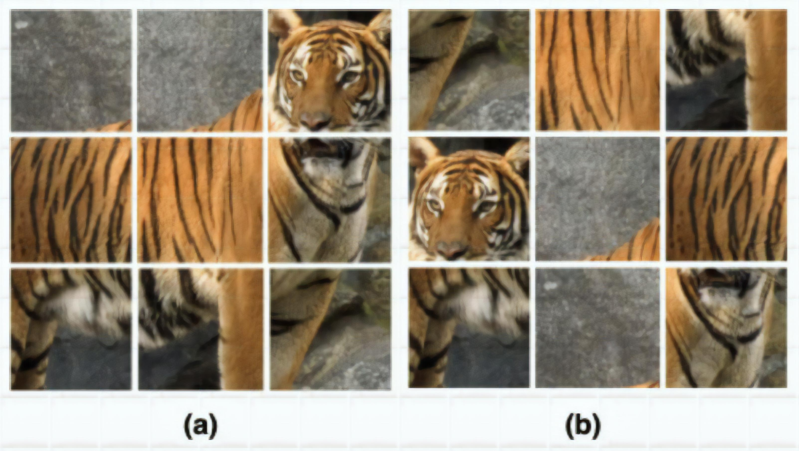
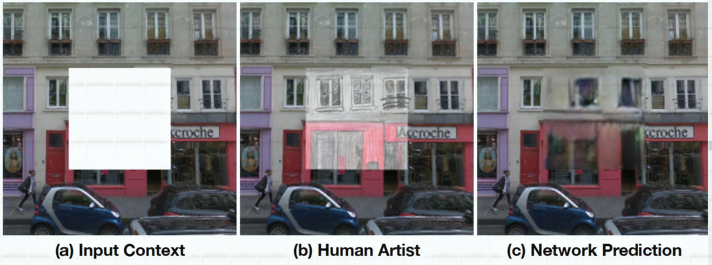

> *In the speech at AAAI 2020, Yann LeCun described Self-supervised learning as "The machine predicts any parts of its input for any observed part".*

### MOTIVATIONS AND IDEAS

Data makes a major contribution to the performance of today's machine learning/deep learning model. In general, having a big and good quality enough dataset is the main factor that makes your model perform well or not. However, the data collection and annotation work usually cost a lot of time and effort.
This is where Self-supervised learning (SSL) comes in to help. The main goal of SSL is to learn visual features from large-scale unlabeled images. 

What makes SSL different from other methods is it takes advantage of ‘pseudo labels’, instead of human-annotated labels. These pseudo labels are automatically generated and completely away from the human force, which we get through very simple operations. For example, a color image is the label of a grayscale image, which we just need to convert color image to grayscale image to have a pair of (input, label). A full-content image is the label of an image occluded by a small region, which we just need a random crop to have a pair of (input, label).

Another advantage of SSL is its ability to extract "common sense" features. Take image classification as an example, to recognize between dog and cat, supervised methods may only need to extract feature representation in some way providing that they are correctly classified. Usually, this type of learning is not similar enough to that of humans. Self-supervised learning is also created for this reason, it can extract feature representation that has common sense properties, such as color, rotation angle, object position, context,... Common sense helps improve 2 things about generalization: the learned representation from one dataset gives good performance when evaluating on another dataset, the learned representation by this problem can be used well on another problem.

### PRETEXT TASKS AND DOWNSTREAM TASKS

When telling about SSL, we certainly have to mention pretext tasks and downstream tasks. The common-sense feature is learned through solving pretext tasks (coloring grayscale images, rotating images, super resolution on images, ...). Afterward, learned knowledge from the above tasks is used to solve downstream tasks - tasks at a higher level of difficulty (image classification, object segmentation, ...)

    <em><b>Figure 1:</b> General pipeline of SSL - the knowledge learned in pretext task training is transferred to downstream task training (Image from \\\[2]).</em>

A pretext task is a task that is used for model pretraining. By solving and studying objective functions of pretext tasks, the networks can learn visual features/representations or model weights which are useful for downstream tasks. Some examples of pretext tasks are: colorization, placing image patches in the right place, predicting rotation of images, placing frames in the right order, inpainting, recovering the input under some corruption, ...

A downstream task is a task that is used for model finetuning. It can be any one of familiar vision tasks like classification or detection where there is a lack of annotated data. Usually, this type of task is utilized to assess the quality of features learned by SSL.

Here are some pretext tasks.

<em><b>Figure 2:</b> Color Transformation as a pretext task (Image from \\\[4]).</em> (a) Original
(b) Gaussian noise
(c) Gaussian blur 
(d) Color distortion (Jitter)

&#8680; By solving this task (color inpainting), a model can grasp the “common sense” of what the color of dog/grass should be.

<em><b>Figure 3:</b> Predicting rotation of image as a pretext task (Image from \\\[6]). </em>

&#8680; By solving this task, a model can grasp the “common sense” of what is the top and what is the bottom of a tree.

<em><b>Figure 4:</b> Solving jigsaw puzzle (context-based) as a pretext task (Image from \\\[4]).</em> (a) Original image
(b) Reshuffled image.
The anchor is the original image while the positive sample is the reshuffled image.

&#8680; By solving this task, a model can grasp the “common sense” of which location each part of a tiger should locate. Through this, a model can know the overall shape of a tiger and the correlative positions of different parts, not just its detailed information of each separated part.

<em><b>Figure 5:</b> Relative position prediction (context-based) as a pretext task (Image from \\\[5]).</em> Given 2 sub images, we need to find the relative positions of them in the original image.

&#8680; Like solving jigsaw puzzles, a model can grasp the knowledge about the overall shape and the relative positions of different parts of a cat.

<em><b>Figure 6:</b> Predicting the corrupted region of an image as a pretext task (Image from \\\[2]).</em>

&#8680; By solving this task, a model can grasp the “common sense” of how to get the semantic meaning of objects derived from the information of context around.

The pictures shown above are just some types of pretext tasks, there are a lot more than that. And in practice, the selection of pretext tasks to use is a very significant factor that influences the performance of SSL. An efficacious pretext task guarantees deep models can exploit semantic features through solving it. However, we should not stick with choosing which tasks to use for too long, quickly go with the simples ones. Additionally, we can also let an SSL model solve multiple tasks at the same time, which is inherently called multi-task learning.

### HOW TO DISCRIMINATE SELF-SUPERVISED LEARNING WITH OTHER LEARNING APPROACHES

Reading until now, you may have question of how to discriminate Self-supervised learning with other learning methods. Below is the table that provides definitions of 5 learning methods with respect to data samples.

<table id="tabletype1">
<tr>
    <th id="colTitle1" width="40%">Learning method</th>
    <th id="colTitle2" width="60%">Definition</th>
</tr>
<tr>
    <td>Supervised learning</td>
    <td>requires data samples with human annotated labels for training</td>
</tr>
<tr>
    <td>Unsupervised learning</td>
    <td>Data samples don’t have any labels or correct outputs</td>
</tr>
<tr>
    <td>Weakly supervised learning</td>
    <td>Data samples only have coarse-grained labels or inaccurate labels</td>
</tr>
<tr>
    <td>Semi-supervised learning</td>
    <td>Dataset is comprised of 2 parts: small amount of labeled data and large amount of unlabeled data</td>
</tr>
<tr>
    <td>Self-supervised learning</td>
    <td>Data samples has pseudo labels instead of human annotated labels; or labels from a coexisting modality (visual content and sound in a video)</td>
</tr>
</table>

Regardless of what category a learning method is included in, it will use similar network architectures as methods in the other categories. Some of the popular architectures are: AlexNet, VGG, GoogLeNet, ResNet, DenseNet, ...

### CATEGORIES OF SELF-SUPERVISED LEARNING

According to \[3], SSL methods can be divided into 3 main categories each of which has architectures containing the generator and the last two types contain discriminator in addition:

    

    <em><b>Figure 7:</b> 3 types of Self-supervised learning: Generative, Contrastive and Generative-contrastive (Image from \\\[3]).</em>

* **Generative model**: the generator includes 2 smaller parts - encoder and decoder. The encoder encodes an input into a latent vector. From this latent vector, the decoder can reconstruct into some types of outputs required for a current problem. (E.g.: graph generation (with applications in drug and material designs)). The latent vector can be used by downstream tasks. This type of model does not have a discriminator. A reconstruction loss is used in the end.
* **Contrastive model**: usually receives 2 inputs. With each input, the encoder can encode it into a latent vector. Then we will have 2 latent vectors that are used to compute similarity. (E.g.: mutual information maximization). The latent vector can be used by downstream tasks. A contrastive similarity (E.g.: InfoNCE) metric is used in the end.
* **Generative-contrastive (adversarial) model**: the generator tries to generate spurious samples and discriminator tries to discriminate these samples from the real ones. (E.g.: GAN). Its latent vector is just implicitly modeled. GAN discriminator has more parameters than contrastive discriminator. Distributional divergence is leveraged as loss (E.g.: Wasserstein distance) in the end.

Here are some pretext tasks which correspond to each model type:

<table id="tabletype1">
<tr>
    <th id="colTitle1" width="30%">Model type</th>
    <th id="colTitle2" width="70%">Pretext tasks</th>
</tr>
<tr>
    <td>Generative</td>
    <td>
- Next word/sentence prediction 
- Next pixel prediction 
- Image reconstruction 
- Link prediction
</td>
</tr>
<tr>
    <td>Contrastive</td>
    <td>
- Relative position prediction 
- Jigsaw 
- Inpainting 
- Mutual information maximization 
- Cluster discrimination
</td>
</tr>
<tr>
    <td>Generative-contrastive</td>
    <td>
- Image colorization 
- Inpainting 
- Super resolution 
- Link prediction 
- Node classification
</td>
</tr>
</table>

Among the three, the contrastive model seems to be the one that is best suited for nearly all visual classification tasks due to the essence of finding the contrastive relation of 2 images, which tries to keep 2 same-class images near and 2 different-class images apart.

    <em><b>Figure 8:</b> The intuition behind contrastive learning approach (Image from \\\[4]).</em>

Having known about the different properties of these model types, we definitely also need to know a little information about their advantages and disadvantages:

* **Generative**:

  * <b>PROS</b>: Generative models recreate the original data distribution without any premises at downstream tasks

    \=> It can widely apply to both generation and classification
  * <b>CONS</b>: In classification, generative model performance is to a much lesser extent than contrastive learning because of its classific essence that has been mentioned above.

    The fact that generative objective has pointwise property results in some shortcomings:

    * immensely sensitive to rare samples.
    * The pointwise nature can just represent low-level abstraction while tasks such as classification or object detection are at high-level abstraction.
* **Contrastive**:

  * <b>PROS</b>: Having assumed classification as the downstream applications, only the encoder is engaged and the decoder is discarded in contrastive learning.

    \=> Therefore, contrastive models are mostly light-weight and perform better in discriminative downstream tasks.
  * <b>CONS</b>: Contrastive is an emerging field and still has many problems to be solved:

    * Contrastive pre-training does not show good results in the NLP.
    * Negative sampling is currently a strict requirement for most contrastive learning, but this procedure is often biased and time-consuming.
    * The theory for why and how data augmentation helps boost contrastive learning’s performance is still quite ambiguous.
* **Generative-contrastive**:

  * <b>PROS</b>: Generative-contrastive is successful in image generation, transformation and manipulation. Unlike generative, it gets rid of the pointwise objective and turns to distributional matching objective, which makes it better tackle the high-level data abstraction.
  * <b>CONS</b>: There are still some challenges for future development:

    * Limited applications in NLP and graph.
    * Easy to collapse.
    * Not for feature extraction.

### SEVERAL LAST WORDS

Self-supervised learning has appeared in many aspects of NLP, but in computer vision its impact has not achieved equal status. This is because ImageNet pretraining has been so popular and successful that pretraining on pretext tasks of SSL has not received much attention yet. One more reason is NLP is a discrete domain while CV is a continuous domain, which means that the learning space of CV is much bigger than that of NLP.

As we can infer, contrastive learning methods presently seem to work better than other Self-supervised learning methods for computer vision. Concurrently, there have been some researches that is toward non-contrastive methods applied to joint embedding architectures ([DeeperCluster](https://openaccess.thecvf.com/content_ICCV_2019/html/Caron_Unsupervised_Pre-Training_of_Image_Features_on_Non-Curated_Data_ICCV_2019_paper.html), [MoCo-v2](https://arxiv.org/abs/1912.03330), [ClusterFit](https://arxiv.org/abs/2003.04297), [SwAV](https://arxiv.org/abs/2006.09882), [SimSiam](https://arxiv.org/abs/2011.10566), ...) as an alternative to contrastive learning in the future.

### REFERENCES

\[1] Yann LeCun and Ishan Misra, [Self-supervised learning: The dark matter of intelligence](https://ai.facebook.com/blog/self-supervised-learning-the-dark-matter-of-intelligence/), Facebook AI, 2021.

\[2] Longlong Jing and Yingli Tian, [Self-supervised learning: The dark matter of intelligenceSelf-supervised visual feature learning with deep neural networks: A survey](https://arxiv.org/pdf/1902.06162.pdf?ref=hackernoon.com), IEEE TPAMI, 2020.

\[3] Xiao Liu et al., [Self-supervised learning: Generative or contrastive](https://arxiv.org/pdf/2006.08218.pdf), arXiv, 2021.

\[4] Ashish Jaiswal et al., [A survey on contrastive self-supervised learning](https://www.mdpi.com/2227-7080/9/1/2/pdf), Technologies 9.1, 2021.

\[5] Jeremy Howard, [Self-supervised learning and computer vision](https://www.fast.ai/2020/01/13/self_supervised/), fast.ai, 2020.

\[6] Aniket Bhatnagar, Dhruv Goyal, Cole Smith and Nikhil Supekar, [Self-supervised learning - Pretext tasks](https://atcold.github.io/pytorch-Deep-Learning/en/week10/10-1/), atcold repo, 2020.