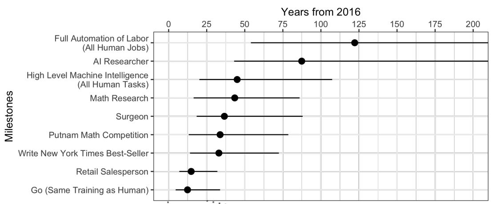
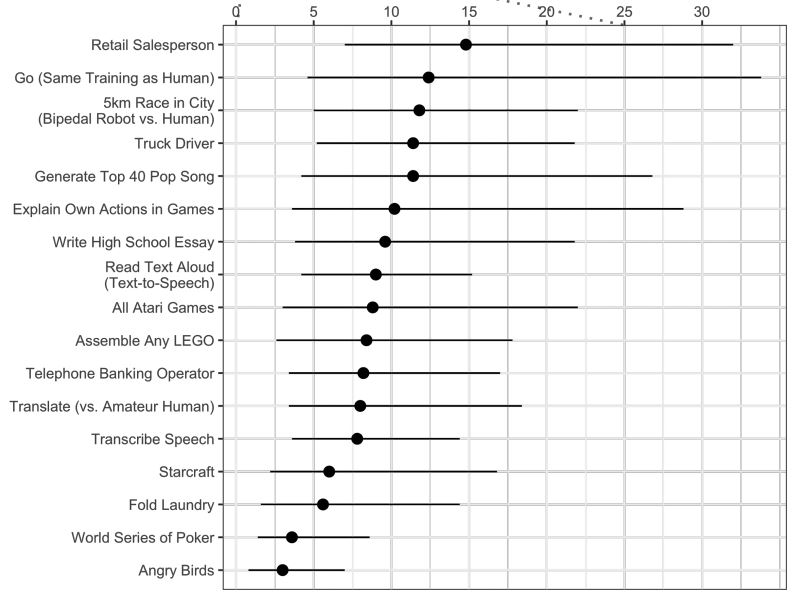

In the previous post, we have discussed some difficulties in AI. But what do scientists in this domain really think about AI? If you want to know, you should continue reading. This post is written as a brief summary of the survey “Viewpoint: When Will AI Exceed Human Performance? Evidence from AI Experts” \[1].

The survey is constituted by the personal opinions of 352 researchers (in machine learning, computer science theory, statistics, and neuroscience), who come from 43 countries. Some of them are researchers with high citations.

There are 32 milestones that are given to the researchers to ask them when each milestone would become possible. Some interesting milestones are: writing a high school essay, generating a top 40 pop song, writing a New York Times bestseller,...

 

    <em><b>Figure 1:</b> Timeline of Median Estimates (with 50% intervals) for AI Achieving Human Performance (Image from \\\[1]).</em>

Specifically, they believe that there is only less than 37 years (median) from 2016 when AI can become a surgeon. And also in accordance with their opinions, AI can even itself become an AI researcher in 40 years to about 200 years or more (median) from 2016. 

In this paper, machine intelligence is said to be at a high level when it can conduct every task better and more economically than humans. By calculating the mean of all respondents, the study shows that there is a 50% chance of High-Level Machine Intelligence (HLMI) achieved within 45 years. Later than that is the full automation of labor which is believed to happen in 122 years from now with 50% probability.

Here are some key findings of the survey:

* “The progression of machine learning has advanced in recent years”.
* “Explosive progress in AI after HLMI is seen as possible but improbable”.
* “HLMI is seen as likely to have positive outcomes but catastrophic risks are possible”.
* “Society should prioritize research aimed at minimizing the potential risks of AI”.

So, despite the need to take the potential risks it may cause, we can see many positive thoughts about the future of AI in the research community.

## References

\[1] Katja Grace et al., [Viewpoint: When Will AI Exceed Human Performance? Evidence from AI Experts](https://www.jair.org/index.php/jair/article/download/11222/26431/), Journal of Artificial Intelligence Research, 2018.